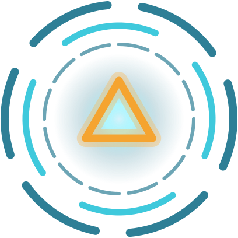

<p align="center"></p>

# J.A.R.V.I.S. Console

[](https://github.com/Evirtual/jarvis/actions/workflows/ci.yml)

An Iron Man–style HUD that talks back. Every figure on screen is **measured, not
simulated** — real CPU cores, real GPU thermals, real devices on your network,
real weather where you actually are. It speaks with a neural voice generated on
your own machine and answers through whichever AI service you connect.

Runs on a desktop and on a phone.

## Quick start

```bash
npm install
```

```bash
npm run serve
```

Then open **http://localhost:7823**.

First start downloads the voice model (~88 MB) and prints a progress bar. Every
start after that is instant.

### Install it as an app

The console is installable on a desktop or a phone — its own icon, its own
window, no browser bars. In Chrome, Edge or Brave use **Install** in the address
bar (or the menu); on an iPhone, **Share → Add to Home Screen**. Browsers only
offer this on a secure origin: `localhost` on the machine itself, or `https`
anywhere else (see [Running it somewhere else](#running-it-somewhere-else)). The
installed app caches nothing — every reading and answer is live.

## The deck, and the board

**JARVIS sits at the bottom of the screen and does not move.** He is the console's
one fixed point, with the two things you do most right beside him — **new thread**
on his left, **keyboard** on his right — and the readings split either side:
this machine (CPU, GPU, Disk) on the left, the world around it (Net, LAN, Sky) on
the right. His light spreads up from him across the board rather than sitting in a
ring around him, and it is fixed there: resizing the window never slides or
stretches it.

**The title row** runs across the top: your **Threads** in the top-left corner
(with a count), the name in the middle, **Configuration** in the top-right. No
window, group or panel ever reaches up into this row, or down over the deck — and
in JARVIS's own column nothing comes lower than the line just above him, so he
and what he's saying are never covered.

**He is also the microphone.** Tap him to talk, tap again to stop; tap while he's
speaking to cut him off. There is no text box until you want one — press any
letter (or the keyboard button) and it rises over the deck; Esc puts it away
again. In **Config → Voice** you can make tapping him open the keyboard instead,
if you'd rather type by default. Replies are spoken sentence by sentence as they
arrive, not after the whole answer is written.

The word just above him says what he's doing — listening, transcribing, thinking,
speaking, sweeping — and is gone when he's idle. One-off results ("Sweep
complete — 12 hosts") appear as a short notice **on that same line**, and so does
the bin; they take turns rather than stacking. On a phone that line always has
room: sheets stop above it and never cover him.

He calls you **sir** — or **ma'am**, if you'd rather: **Config → Voice → Address
me as**, or just say "call me ma'am". It applies to everything he says and writes,
his own notices included.

The board above him:

- **A thread is a window.** One thread on its own is just that — no group, no
  label around it. Each gets its own colour, and a `#ABCD` tag so two threads with
  the same name can be told apart ("close Research #7F2K"). Drag its title bar to
  move it; resize it from any edge or corner (double-click one to reset). A window is
  one fixed size, like a panel: the screen changing width never resizes it or
  slides it about — it only comes back into view if it would be off the edge.
  Dragging a window with a video playing in it doesn't interrupt the video
  (moving it into a *different* group does reload the player).
- **Tidy up.** After a smaller screen or a busy session has left windows piled
  on each other, **Tidy up** in the Threads panel — or "tidy up the board" —
  packs every window and group from the top-left, clear of each other, of open
  panels and of JARVIS, keeping their sizes. (On a phone the list is already
  tidy; drag to reorder instead.)
- **Whatever you touch is on top.** Windows, groups and panels share one stacking
  order: the one you clicked (or asked for) comes above everything else, the one
  before it sits just under it, and so on. The order is remembered.
- **A group is what you get when you put two threads together.** Drop one window
  onto another and they become a bubble; drop more in to add them. The bubble's
  colour is the blend of its threads'. Take threads out and when one is left the
  bubble dissolves where it was — a group of one isn't a group. Drop a window onto
  JARVIS to pull it out of its group.
- **Bubbles** can be moved by their name, resized from any edge or corner, and
  folded to a single orb. Windows inside a bubble grow from their right and
  bottom edges, since the bubble decides where they sit. Deleting a bubble takes its threads with it
  (after asking).
- **Windows stay as you leave them.** The first click on a window only brings it
  forward; clicking the title bar of the window you're in folds it to a bar.
  Nothing folds or shrinks on its own. "Minimise the Cambodia thread" and "expand
  it" work too. A conversation stays on its latest line when its window changes
  size, unless you've scrolled up to read.
- **Where things go.** A new thread opens in the middle of the board, between the
  top and JARVIS, and works outward from there, keeping clear of open panels.
  Anything you've placed by hand stays where you put it; closing a thread never
  moves the others. A window dragged partly off the screen comes back into view
  when you let go.
- **The bin** rises just above JARVIS the moment you pick something up. Dropping
  something there asks before it deletes ("yes"/"no" by voice works too).
- **Nothing is strung across the screen.** What connects threads is shown on
  demand: press **⌗** on a window (or double-click it) and the threads that share
  its context appear as small copies of their own windows — same glass, colour and
  tag, what each last said, and chips for what they have in common — joined to it
  by strands in each thread's colour, brighter and thicker the stronger the link.
  Wide screens lay them out either side like a mind map; a phone lists them under
  it. Tap one to go to it; Esc or a tap elsewhere closes the web.
- **One material, one veil.** Every box is the same see-through, blurred glass,
  tinted by its own colour; everything modal — the configuration drawer, a
  confirmation, the web — sits over the same blurred veil.
- **A clean screen is the starting state.** No thread exists until you ask
  something; the first question opens the thread it belongs in.
- **Nothing is undeletable.** The last thread can be closed, and "delete
  everything" (or the button in the Threads panel) clears the board and the
  archive after asking. What you get back is the clean screen.

**The readings** — CPU, GPU, Disk on the left; Net, LAN, Sky on the right — are
icons with their live values, each in its instrument's own colour, the same colour
as its panel. As the screen narrows, each side folds its least important readings
into its own **More**; on a phone each side is just its More button, and the two
open two separate sheets (*Systems* and *Surroundings*). Each reading opens its
instrument panel. Panels are glass like the thread windows, with the same
title-bar icons at the same size; drag one by its title and resize it from any
edge or corner, and the readings inside scale with it. On a phone the panels join
the top of the thread list and scroll with it — open as many as you like — and the
list uses the full height of the screen, fading to a faint trace behind JARVIS
and the bottom buttons so they are never hidden. The Threads list and the More
sheets open as modal sheets instead, ending just above the bottom buttons — the
same gap above them as they keep from the screen edge — over the same blurred
veil as every other modal; a tap outside closes them. The list keeps room
below its last item, so scrolled to the end, every thread — its bottom border
included — sits clear of JARVIS and the bottom buttons; a thread alone on the
board fills the list down to that line and scrolls inside.
Everything that lines up with the screen edge — title row, deck, list, sheets —
keeps the same 16px margin on a phone as on a desktop.

**On a phone the list is yours to order.** A new thread goes to the top and the
list scrolls up to it, wherever you were. Drag any thread by its title bar to
move it up or down (inside a group too); the list scrolls along when you reach
its edge, the others make way, and the order is remembered. A tap on the title
bar still folds or opens it.

The **Threads** panel is the same board as a list — every group, what's in it,
and everything you've put away, with restore and delete. Its count is every
thread you still have, put away or not; it only drops when one is deleted.

### Close, clear, delete

Three different things, kept apart:

| Word | What happens |
| --- | --- |
| **Close / archive** (`×`, "close this chat") | Put away with its subthreads. Recoverable from the Threads list. |
| **Clear** ("clear this thread") | Empties the history, keeps the thread. Asks first. |
| **Delete** (bin, Threads list, "delete this thread permanently") | Gone for good. Always asks first — and the AI can never do it. |
| **Put all away / delete everything** ("close all threads", "delete everything", "start fresh") | The whole board at once. Putting away is recoverable; deleting asks first and takes the archive with it. |

JARVIS's own remarks about the console ("Put that away, sir") are said as a notice
and not written into any thread, so a thread holds only its own conversation.

## Images and videos

Ask for pictures or footage — *"show me images of the aurora over Vilnius"*,
*"find videos of the Rail Baltica works"* — and the results appear inside the
thread, the full width of its window:

- **Images** load directly from where they're hosted. Click one to open its page.
- **Videos** from YouTube and Vimeo play in the thread. YouTube is embedded
  through `youtube-nocookie.com`.
- The image or player *is* the source, so no written links are added after it.
  Anything that isn't a direct image or a YouTube/Vimeo video is left out rather
  than shown as a broken box.

When you ask for sources for an ordinary answer, they're listed as links you can
click; otherwise answers name their sources in words. Links are never read aloud.

## Connecting a service

Open **Config → Connections**. Each service is a card that tells you what it is,
what it costs, and what to do — with the key page one tap away.

| Service | Cost |
| --- | --- |
| **Gemini** | **Free tier, no credit card.** Flash models, ~1,500 requests a day. Google may use free-tier data to improve their models. |
| ChatGPT | Pay per token. Separate from a ChatGPT Plus subscription. |
| Claude | Pay per token. Separate from a Claude Pro subscription. |

Paste a key, press Connect, and it is validated immediately — then you pick the
model from **your account's real list**, so a retired model can never silently
break the console. Keys are stored in `config.json` on this machine, `chmod 600`,
and are never sent to the browser; the screen only ever shows a masked tail.

An existing `OPENAI_API_KEY`, `ANTHROPIC_API_KEY` or `GEMINI_API_KEY` in the
environment is picked up automatically and labelled *from environment*.

If a service stops answering, JARVIS says why in plain words: a rejected key, a
model this account can't use, or an account that is **out of credit** — which is
account-wide, so picking a different model of the same service won't help (add
credit on its billing page, or switch to Gemini's free tier). The provider's own
error is written to the server console for diagnosis; keys never appear in it.
The service's card in Connections shows the same problem under its name — a key
can list models perfectly well on an account that can't answer — until the next
answer gets through.

> **On subscriptions.** A ChatGPT Plus or Claude Pro plan does not include API
> access — they are separate products. Gemini's free tier is the honest answer if
> you want AI without per-token billing.

## The voice

[Kokoro-82M](https://huggingface.co/hexgrad/Kokoro-82M) (Apache 2.0) via
[`kokoro-js`](https://www.npmjs.com/package/kokoro-js), running locally on CPU.
Default is **`bm_george`** — British male, Received Pronunciation.

Eight British voices plus American ones live under **Config → Voice**, with
timbre and cadence sliders. Replies are split into sentences so the first phrase
starts playing while the rest is still generating, and repeated lines are cached.

`KOKORO_DTYPE=fp32` for higher fidelity (~326 MB, slower), `q4` for smaller and
rougher. Default `q8`. If the model fails to load, the console says so and falls
back to your browser's own voices rather than going silent.

With ChatGPT connected, the mic records in the page and the server transcribes it
with `gpt-4o-mini-transcribe`, primed with the console's vocabulary so voice
names and commands come back spelled right. Recording stops by itself about a
second after you stop talking, and never runs while JARVIS is speaking — so he
can't hear himself.

## Everything by conversation

Anything you can click, you can say, on its own or mid-sentence. An utterance is
split into instructions and a question: *"start a new chat and find today's news
in Cambodia"* opens a window and asks that question in it.

- Threads: "open a new chat and…", "branch off and…", "close this chat",
  "restore Cambodia", "go back to Lithuania", "open the Cambodia thread",
  "rename this to…", "rename Solar storms to Space weather", "minimise this
  thread", "expand the Cambodia thread", "put all away" — add the `#tag` when two
  share a name
- Groups: "connect Lithuania with Trip planning" (they end up in one bubble),
  "move Lithuania into Travel", "new group called Home lab", "collapse Research",
  "expand Research", "rename the Research group to Deep dive", "delete the
  Research group"
- Research: "set up a research group on Baltic security with a thread on the
  cables and one on the shadow fleet" — JARVIS opens the group and gives every
  thread its own question, answered one after another. Asked at an empty board,
  the request itself doesn't linger as a thread of its own.
- Media: "show me images of…", "find videos of…"
- Panels: "show the radar", "open the weather", "show the threads", "close all
  panels"
- Voice: "use the Lewis voice", "speak faster", "mute", "unmute", "call me ma'am"
- Setup: "switch to Gemini", "open config" — or paste an API key straight into the
  chat; it's stored locally and never sent to a model

Phrasings the built-in patterns miss still work: the reasoning core can operate
the same actions itself, from a fixed whitelist. It can open, group, connect,
rename, fold and put away threads — it can never delete anything, answer a
confirmation on your behalf, or change a model.

**JARVIS sees the whole console.** Every question carries a snapshot: every group,
every thread with a summary and its tag, what connects them, what's open, how he's
set up. A thread's own answers are based on that thread alone — a new subthread
also hears the tail of the thread it grew from, and nothing else bleeds across.

Short questions about this machine ("status", "my IP", "weather") are answered
instantly from live readings; anything longer goes to the core with web search.
A question asked while an answer is still arriving is queued, not dropped. Enter
sends.

## What's actually real

| Reading | Source |
| --- | --- |
| Per-core CPU load | `os.cpus()` tick deltas |
| Memory | `os.totalmem/freemem` |
| GPU util, temp, VRAM, watts, clock | `nvidia-smi` |
| Wi-Fi SSID/signal/radio, throughput, disks, gateway, DNS | one PowerShell probe, every 20 s |
| Battery | the same probe — shown as the arc around JARVIS, red when low and unplugged |
| Perimeter radar | real ICMP sweep of your /24 — bearing is a stable hash of the address, **radius is genuine round-trip time** |
| Device identity | ARP table + MAC OUI lookup, with randomised privacy MACs labelled as such |
| Public IP, ISP, ASN, city | ip-api.com |
| Weather, sunrise, sunset | open-meteo.com |
| Internet latency | real pings to your gateway, 1.1.1.1, 8.8.8.8 |

**The network is swept once when the server starts**, so the Perimeter panel has
something to show, and after that **only when you ask** — Sweep on the panel, or
"scan the network". It is never polled in the background. The sweep is discovery
only: ICMP, ARP and reverse DNS on your own subnet; it does not port-scan anything.

**Two outbound services see your IP** for readings: ip-api.com and open-meteo.com.
Set `JARVIS_OFFLINE=1` to disable both — the console then reports it has no uplink
data rather than inventing any. Images and videos you ask for are loaded from the
sites that host them, which therefore see your IP too; images are fetched without
a referrer.

## Keeping it to yourself

The server listens on the machine's interfaces so a phone on your network can use
it, but it is deliberately unfriendly to anything else:

- **No CORS.** The console is served from the same origin; in dev, Vite proxies
  `/api`, so the browser never makes a cross-origin call.
- Anything that changes state must carry the console's own header, which a page
  on another site cannot set without a preflight that is never granted.
- Keys never reach the browser or a model; a key pasted into the chat is
  intercepted locally and stored server-side.
- Replies are always rendered as text. Only `https` links become clickable, and
  videos are embedded only from YouTube and Vimeo, by validated video ID.

## Running it somewhere else

JARVIS is not a static site: the console needs its own server, on the machine
whose readings it shows — that server reads the CPU, GPU and disks, sweeps the
local network, runs the voice and holds the API keys. So it can't be hosted on
GitHub Pages; a Pages copy would be a screen with nothing behind it.

To reach it from a phone away from home (and so install it there), put the
server behind an https tunnel — for example a Cloudflare Tunnel from
`jarvis.<your-domain>` to `http://localhost:7823` — **and** put an access
check in front of it (Cloudflare Access, or similar). The server is built to
refuse other websites, not other people: anyone who can open the address can use
your API credit, see your machine's readings and sweep your network. Never expose
it without that check.

## Development

```bash
npm run dev
```

Vite with HMR on :5173, proxying `/api` to the server on :7823.

```bash
npm run typecheck
```

```bash
npm test
```

Run the typecheck before trusting a change: Vite and the test runner both strip
types without checking them, so the app can build and every test can pass while
the types are broken.

| Path | What |
| --- | --- |
| `src/shared/types.ts` | The client/server contract — both sides import it, so the API can't drift |
| `src/client/workspace.ts` | Threads, groups, colours and their lifecycle, as pure data (plus migrations) |
| `src/client/commands.ts` | What can be said or written as a directive, and what the model may not do |
| `src/client/main.ts` | Boot only: imports the modules below in order and starts them |
| `src/client/state.ts` | The singletons every module shares (stage, workspace, panels, voice, connections) |
| `src/client/deck.ts` | The deck and title row: readings, More sheets, the phone/desktop switch |
| `src/client/readings.ts` | Painting the live readings, and receiving them over one pushed stream |
| `src/client/say.ts` | How JARVIS speaks to you: notices, lines in a window, his status word, busy |
| `src/client/ask.ts` | The command line, the queue, what the core is told, the streamed answer |
| `src/client/actions.ts` | Carrying out every action, by you or by the core's directives |
| `src/client/confirm.ts` | Anything destructive waits for a yes — by button or by word |
| `src/client/local.ts` | Questions answered from live readings, never from a model |
| `src/client/threads.ts` | The Threads list, what the stage reports back, the links between threads |
| `src/client/voice-ui.ts` | JARVIS as the microphone, the keyboard, Esc, the voice controls |
| `src/client/drawer.ts` | The configuration drawer and its tabs |
| `src/client/stage.ts` | The board: JARVIS, windows, bubbles, the bin, media in threads |
| `src/client/web.ts` | The context web, as its own component with a small host interface |
| `src/client/core-draw.ts` | JARVIS drawn: the aurora, rings, plasma, spectrum and battery arc — pure drawing |
| `src/client/panels.ts` | The instrument panels: placement, dragging, resizing |
| `src/client/stack.ts` | One stacking order for windows, groups and panels — last touched on top |
| `src/client/icons.ts` | Every drawn icon, once: title-bar buttons and the instrument pictures |
| `src/client/address.ts` | Sir or ma'am, and turning the console's own lines round to match |
| `src/client/styles.css` | Ends with the two shared materials, `.glass` (every box) and `.veil` (behind anything modal); use the class rather than restyling an element |
| `src/server/` | HTTP, credential store, provider adapters, telemetry, scan, world, Kokoro |
| `tests/` | Node's test runner over the pure modules |
| `src/client/public/` | The logo (`icon.svg`, JARVIS's core simplified), app icons, manifest, the do-nothing service worker that makes it installable, robots and sitemap |
| `scripts/icons.mjs` | Renders every icon size and the social preview image from `icon.svg` — run it after changing the logo |
| `.github/workflows/ci.yml` | Typecheck, tests and build on every push and pull request |
| `docs/QA.md` | The manual test plan: every feature, its steps and edge cases, and a log of each run |
| `docs/PLAN-code-mode.md` | The plan for the next big feature: a code mode driven by the Claude Agent SDK or the Codex SDK |

**What the tests cover:** migrations (including bringing an older save forward
without losing a message), creating and branching threads, grouping and
ungrouping, thread colours and blended group colours, where loose windows are
kept, focusing, persistence round-trips, the archive/clear/delete rules, context
isolation between threads, relatedness for the web, the command parser (opening,
renaming and folding by name, putting everything away, sir/ma'am), how an older
save's positions are converted, and the directive whitelist (the model can't
delete or confirm). **What they don't:** anything in a browser — the canvas,
dragging, resizing, stacking, layout, media embedding and the voice pipeline are
checked by hand against [`docs/QA.md`](docs/QA.md).

**How the readings arrive.** The console holds one `/api/events` stream open
(server-sent events) and the server pushes a reading only when it has changed —
no polling. The stream closes a few seconds after the tab is hidden and reopens
the moment it is looked at, so a background tab costs nothing; a panel's body is
painted only while it is open, and the radar is drawn only while Perimeter is.
JARVIS himself draws at 30 fps at rest and 60 while anything moves.

Vanilla TypeScript, no UI framework — the board is canvas plus DOM writes when a
reading changes,
and a re-render layer would add weight without buying anything.

## Notes

- `POST /api/speak` returns 16-bit PCM WAV at 24 kHz. Requests are serialised
  (single ONNX session) and LRU-cached.
- Kokoro's pitch is fixed per voice, so **Timbre** applies only to system
  voices; **Cadence** maps to Kokoro's `speed` either way.
- Everything on the board lives in this browser's storage. Clearing site data
  clears the board; the keys and the voice live on the server instead.
- Positions are saved from the board's top-left corner. Saves from before that
  (measured from the centre) are converted once, on the first load, to where
  things were on that screen.
- A panel you haven't placed opens down its own side (machine instruments on the
  left, the world on the right), below any panel already there, then in a column
  further in — never on another panel while there's room. It can sit over a
  thread; whichever you touch comes to the top. Once you drag a panel, it stays
  where you put it.
- An earlier version had a built-in code agent. It has been removed; conversations
  from it are kept as ordinary threads, renamed "Previous conversation".
